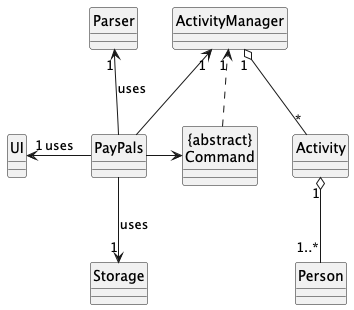
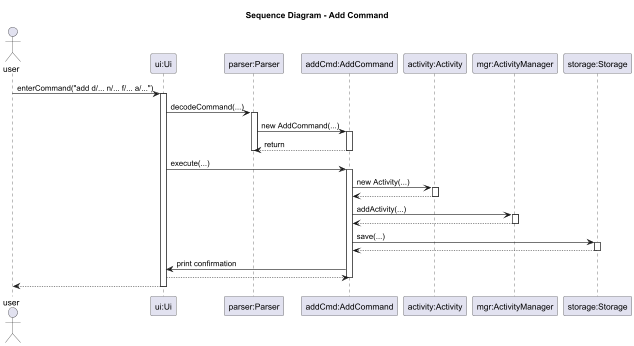
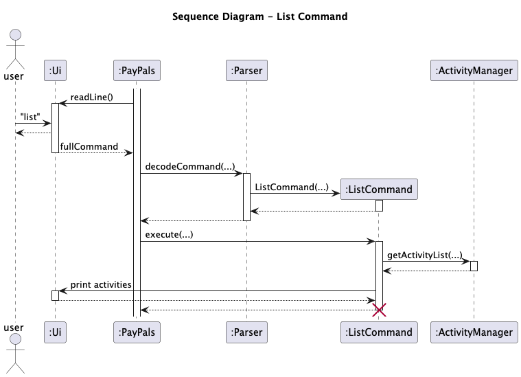
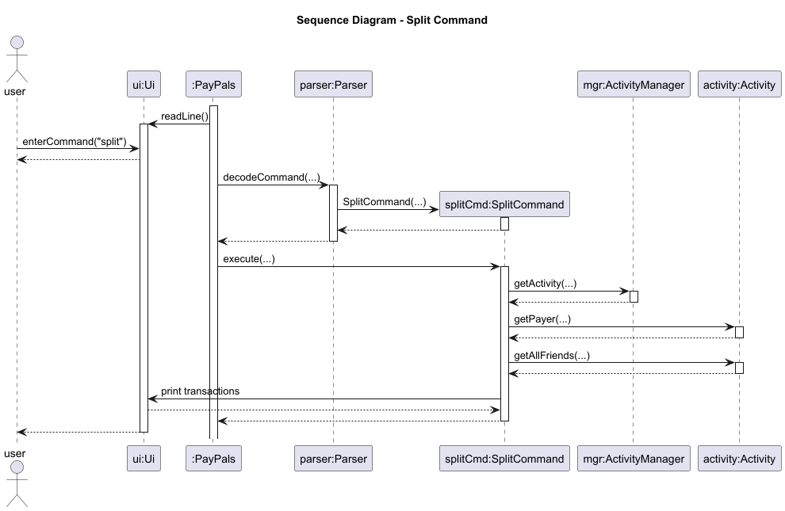
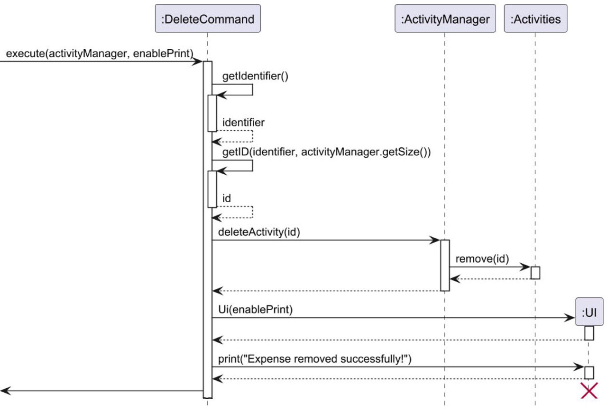
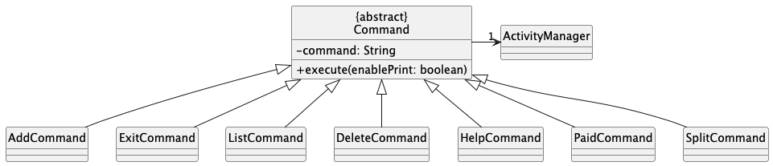
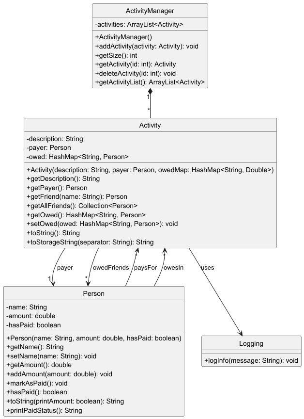
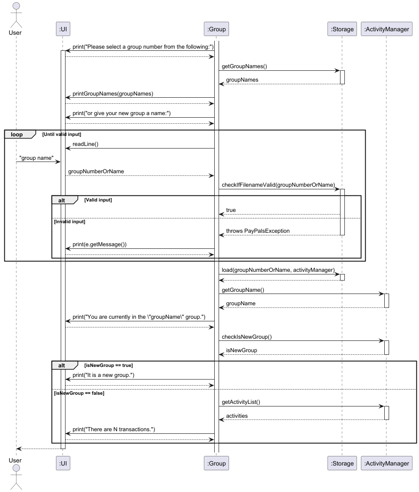
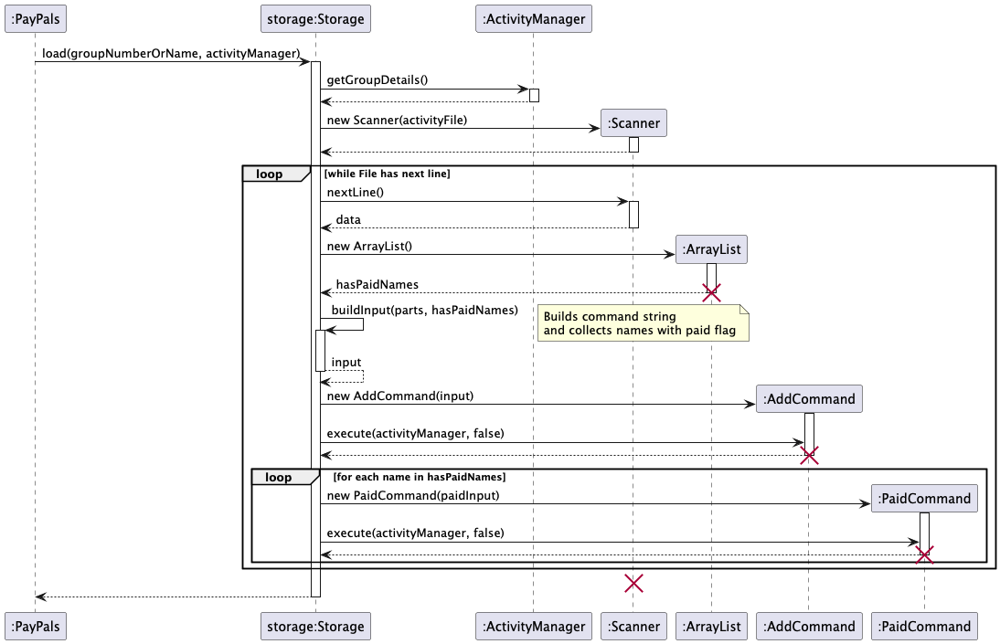

# Developer Guide
## Table of Contents
- [Developer Guide](#developer-guide)
- [Table of Contents](#table-of-contents)
- [Acknowledgements](#acknowledgements)
- [Design \& Implementation](#design--implementation)
  - [Architecture](#architecture)
  - [UI Component](#ui-component)
  - [Parser Component](#parser-component)
  - [Command Component](#command-component)
  - [Activity Component](#activity-component)
  - [Storage Component](#storage-component)
  - [Common Classes](#common-classes)
- [Documentation, logging, testing, configuration, dev-ops]()
- [Appendix: Requirements](#appendix-requirements)
  - [Product scope](#product-scope)
    - [Target user profile](#target-user-profile)
    - [Value proposition](#value-propposition)
  - [User Stories](#user-stories)
  - [Use cases](#use-cases)
  - [Non-functional Requirements](#non-functional-requirements)
  - [Glossary](#glossary)
- [Appendix: Instructions for Testing](#appendix-instructions-for-testing)
  - [Manual Testing]()
  - [JUnit Testing]()

## Acknowledgements

PayPals uses the following tools for development and testing:

1. [JUnit 5](https://junit.org/junit5/) - Used for software testing.
2. [Gradle](https://gradle.org) - Used for build automation.

## Design & Implementation

Note that for all sequence diagrams in this guide, the lifelines should terminate with the cross, but due to the limitations of PlantUML, the lifeline is shown to continue.

The UML class diagram below provides an overview of the classes and their interactions within the PayPals application.




Given below is a quick high level overview of the main components and how they interact with each other.  
  
**Main components of the architecture**  
` PayPals` is in charge of the app launch and shut down.  
- At app launch, it initializes the other components in the correct sequence, and connects them up with each other.
- At shut down, it shuts down all components.

The bulk of the app's work is done by the following five components:

* `Ui`: The UI of the App.
* `Parser`: Parses user input into executable commands.
* `Command`: The command executor (with subclasses like `AddCommand`, `ListCommand`, and `SplitCommand`).
* `Activity`: Holds the data of the App in memory.
* `Storage`: Reads data from, and writes data to, the hard disk.

**How the architecture components interact with each other**  
The _Sequence Diagrams_ below illustrates how these components interact across four key scenarios:

1. When the user issues an `add` command — showing parsing, command execution, activity creation, and data persistence.
2. When the user issues a `list` command — showing command execution and retrieval of activity data.
3. When the user issues a `split` command — showing how debts are calculated and resolved using in-memory data.
4. When the user issues a `delete` command — showing how expenses are deleted in the database.

This sequence diagrams below captures the flow from the user's input all the way to command execution and interaction with both memory (`Activity`) and disk (`Storage`), giving a comprehensive overview of the core execution paths in the application.






### UI Component

<ins>Overview</ins>

The UI functionalities acts as the interface between the user and the application. It is managed by the `UI` class
which handles the reading of the user input and displaying messages to the user. The user input is then handed over to
the `Parser` to decode.

<ins>Attributes</ins>

The `UI` class has the following attributes:

* `in`: A `Scanner` object used for reading from `System.in` I/O.
* `enablePrint`: A boolean variable to allow printing if it is set to `true`, otherwise disable any printing if it is
set to `false`.

<ins>Methods</ins>

The `UI` class has the following methods:

* `UI`: Constructs the `UI` object and initializes the attributes of the object.
* `readLine`: Reads the user input from the console and return it as a String.
* `print`: Prints the message specified in the input to the console.
* `printPrompt`: Prints the `> ` character to prompt the user for input.
* `printLine`: Prints a horizontal line to act as a divider.
* `sayHello`: Prints a greeting message on the console.
* `sayGoodbye`: Prints a farewell message on the console.

### Parser Component

<ins>Overview</ins>

The `Parser` is responsible for parsing the user input and returning the corresponding `Command` object.

<ins>Attributes</ins>

The `Parser` class has the following attributes:

* `COMMAND_EXAMPLE`: A static final `Map` object that maps each command type to a String containing the correct input
format of that command type.

<ins>Methods</ins>

* `decodeCommand`: Parses the user input and returns the corresponding `Command` object.

### Command Component

<ins>Overview</ins>

The abstract `Command` class has been implemented to introduce an additional layer of abstraction between I/O and command execution, allowing for separation of handling command keywords and executing commands.

The `Command` class has been subdivided into further packages for similar commands, such as `AddCommand` and `DeleteCommand`.

<ins>Implementation Details</ins>

The following diagram is an inheritance diagram for `Command` and its children classes. This has been heavily simplified to show just the high level overview.


<ins>Attributes</ins>

The abstract class `Command` have the following attributes:

* `command`: String containing the command that was input by the user.

<ins>Methods</ins>

The abstract class `Command` have the following methods:

* `Command`: Constructor that updates the `command` attribute based on its input argument.
* `execute`: Method that is overridden by its child classes to fit their functionalities.

The following diagram is a sequence diagram for when `execute` is called for a `DeleteCommand`. It shows how the command class updates the *Activity* component and uses the *UI* component to notify the user of a successful execution.


### Activity Component
<ins>Overview</ins>

The Activity component models shared expenses in PayPals. It stores the activity description, the payer, and a list of people who owe money. 

The ActivityManager class manages a list of these activities, while the Person class represents individuals involved.

<ins>Implementation Details</ins>

The following diagram shows the key classes in the Activity component and their relationships. This has been simplified to highlight the core data model:



### Storage Component

<ins>Overview</ins>

The `Storage` class is responsible for managing the loading and saving of transaction and activity data from and onto the local machine. `PayPals` will load saved data from the appropriate group's save file right after starting the application and save all the data back into the respective save file when the application exits.

<ins>Implementation Details</ins>

`Storage` creates a `master-savefile.txt` in the directory `./data`. This master file contains the list of all existing groups. Each group has its own save file (e.g., `Singapore Trip.txt`) stored in the same `./data` directory. 

The `master-savefile.txt` contains a list of all group names, one per line.

The file format for group-specific save files is as follows:
```
DESCRIPTION|PAYER|AMOUNT|HASPAID|FRIEND|AMOUNT|HASPAID...
```

Do note that format above is just an example representation, the storage does not actually use the `|` character as the separator. 
An example of an actual save file is shown below.


The storage would need to load the group that the user has selected during the Group Selection Menu, and then load the data from that group's save file into the `ActivityManager`.
The following is the sequence diagram for how the data is loaded during group selection.



The sequence diagram below shows how the data is loaded from the save file into the `ActivityManager`.



<ins>Attributes</ins>

* `SEPARATOR`: String containing the ASCII character 31 which is an untypable character and used as the separator when storing data in the save file.
* `MASTER_FILE_STRING`: String representing the name of the save file containing the group names.
* `FILE_EXTENSION` String containing the extension `.txt`.
* `STORAGE_FOLDER_PATH`: String representing the path of the `data` directory which contains the save file.
* `masterFile`: A File object representing the `master-savefile.txt` file.
* `activityFile`: A File object representing the `savefile.txt` file.
* `scanner`: A Scanner object used for reading the data from the save file.

<ins>Methods</ins>

* `Storage`: Creates the relevant storage directory and file if it does not exist, while initializing the attributes of the object.
* `save`: Goes through each `Activity` in `ActivityManager` and saves its data in the save file.
* `load`: Reads the save file line by line with the `Scanner` object and load the data into `ActivityManager`.
* `checkIfFilenameValid`: Checks the user input whether it is a valid filename before creating the file.
* `loadFromGroupName`: Reads from the save file that was specified as the group name by the user.
* `processLine`: Processes a single line of the save file to be loaded.
* `buildInput`: Builds the command input string from the parts obtained in the save file, while also recording each `Person` that `hasPaid` is `true`.
* `executeAddCommand`: Creates and executes the add command to load the data from a specific `Activity` into `ActivityManager` based on the input string.
* `executePaidCommand`: Creates and executes the paid command for each name in a specific `Activity`
* `deleteDir`: Recursively delete a directory and all its contents.
* `getGroupNames`: Retrieves the `groupNames` attribute.

<ins>Design Considerations</ins>

Instead of saving all the data when the program exits, we have decided to implement saving after every command that
involves updating data. This is because it allows any changes to still be saved in the event that the application exits
unexpectedly.

## Appendix: Requirements

### Product scope

#### Target user profile:
- has a need to manage expenses when travelling with friends
- prefer desktop apps over other types
- prefers typing to mouse interactions
- is reasonably comfortable with CLI apps

This product is for university students who frequently travel with friends, especially several groups of friends.

#### Value proposition

The product aims to provide assistance in simplifying payments by minimising the number of transactions needed to balance expenses.

### User Stories

| Version | As a ...                          | I can ...                                                         | So that I ...                                               |
|---------|-----------------------------------|-------------------------------------------------------------------|-------------------------------------------------------------|
| v1.0    | student                           | add an expense and specify who paid and who owes                  | can keep track of spending                                  |
| v1.0    | student who paid for a whole meal | split expenses                                                    | can fairly divide shared costs based on consumption         |
| v1.0    | user                              | delete an expense                                                 | can get rid of an incorrect entry                           |
| v1.0    | user                              | mark expenses as settled or unsettled                             | can keep track of cleared debts                             |
| v1.0    | user                              | view the expenses                                                 | know how much I owe or how much someone owes me             |
| v1.0    | user                              | save current expenses when I exit the application                 | can view them again when I run the application another time |
| v2.0    | new user                          | use a command to display all the common commands and their syntax | know how to use the app                                     |
| v2.0    | user                              | edit an expense                                                   | can correct any mistakes I made when entering them          |
| v2.0    | user                              | add an expense and split the cost equally among multiple people   | don't need to manually calculate individual shares.         |
| v2.0    | user                              | create a new group                                                | can manage expenses with specific people                    |
| v2.0    | user                              | delete a group                                                    | discard a group I don't want to track anymore               |

### Use cases
(For all use cases below, the **System** is `Paypals` and the **Actor** is the `user`, unless specified otherwise)
### Use case: Delete an expense  
  
**MSS**
1. User selects the trip group
2. User requests to list expenses
3. Paypals shows a list of expenses
4. User requests to delete a specific expense in the list
5. Paypals deletes the expense
  
&ensp; &ensp; Use case ends  
  
**Extensions**
- 3a. The list is empty.  
    Use case ends.
- 4a. The given index is invalid.
  - 4a1. Paypals shows an error message.  
    Use case resumes at step 3.

### Use case: Mark an expense as paid

**MSS**
1. User selects the trip group
2. User requests to list expenses
3. Paypals shows a list of expenses
4. User request to mark a specific expenese as paid in the list
5. Paypals marks the expense as paid

&ensp; &ensp; Use case ends

**Extensions**
- 3a. The list is empty.
    Use case ends.
- 4a. The given index is invalid.
  - 4a1. Paypals shows an error message.
    Use case resumes at step 3.
    
### Non-Functional Requirements
1. The application should work on any mainstream OS as long as it has Java `17` or above installed.
2. The application should be able to hold up to 1000 expenses without a noticeable sluggishness in performance for typical usage
3. A user with above average typing speed for regular English test (i.e. not code, not system admin commands) should be able to accomplish most of the tasks faster using commands than using the mouse.

### Glossary

* *Mainstream OS* - Windows, Linux, Unix, macOS
* Payer - The person that has paid for a specific activity for the group.
* Friend - A friend that is part of an activity that owes money to the payer.

## Instructions for testing
* Technical Requirements: Any mainstream OS, i.e. Windows, macOS or Linux, with Java 17 installed. Instructions for downloading Java 17 can be found [here](https://www.oracle.com/java/technologies/downloads/#java17).
* Project Scope Constraints: Data storage is only to be performed locally.
* Quality Requirements: The application should be intuitive and easy to use by a beginner with little to no experience with CLIs.

### Manual Testing

Please view the [User Guide](UserGuide.md) for the full list of UI commands, their related use cases and the expected outcomes.

### JUnit Testing
JUnit tests are written in the [`test directory`](../src/test/java/paypals) and serve to test key methods part of the application.
