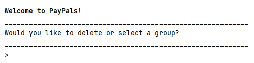

# PayPals

[](https://github.com/AY2425S2-CS2113-T13-2/tp/actions)



PayPals is a Command-Line Interface (CLI) application designed to simplify expense tracking and settlement for groups. It calculates the **minimum number of transactions required** to balance shared costs, making it ideal for trips, projects, or housemates.

## Key Features

*   **Group Management:** Organize expenses into separate groups (e.g., "Japan Trip", "Project Alpha").
*   **Expense Tracking:** Add expenses, specifying the payer and how costs are split (custom amounts or equally).
*   **Simplified Debt Settlement:** Automatically calculate the optimal payment plan to settle all debts with the fewest transactions.
*   **Status Tracking:** Mark individual debts or entire expenses as paid/unpaid.
*   **Editing:** Modify existing expense details (description, payer, amounts, participant names).
*   **Data Persistence:** Your expense data is saved automatically.
*   **Clear Listing:** View all expenses, filter by person, and check net balances.

## Quick Start

1.  **Prerequisites:** Ensure you have Java 17 or later installed.
2.  **Download:** Get the latest `Paypals.jar` from the [Releases page](https://github.com/AY2425S2-CS2113-T13-2/tp/releases).
3.  **Run:** Open a terminal or command prompt, navigate to the folder containing the JAR file, and execute:
    ```bash
    java -jar paypals.jar
    ```
4.  **Interact:** Follow the prompts to select or create a group, then start entering commands (e.g., `help`, `add ...`, `list`).

## Documentation

*   **User Guide:** For detailed instructions on how to use PayPals, including all commands and examples, please see the [User Guide](UserGuide.md)
*   **Developer Guide:** For insights into the design, architecture, and implementation details, refer to the [Developer Guide](DeveloperGuide.md)
*   **Who are We:** To learn more about the four developers from NUS working on PayPals, refer to [About Us](AboutUs.md)

## Acknowledgements

PayPals utilizes these great tools:

*   [JUnit 5](https://junit.org/junit5/): For unit testing.
*   [Gradle](https://gradle.org): For build automation.
